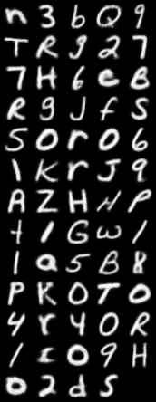

# Crypson

This work presents __Crypson__, a framework that leverages modern advances in artificial intelligence to address security challenges in end-to-end encryption. Specifically, Crypson is a peer-to-peer encryption framework that uses a conditional Generative Adversarial Network (cGAN) to generate images from a sequence of letters, a Variational Auto-Encoder (VAE) to compress the images into a latent space, and a classifier to predict the class of the received samples. The framework is designed to be secure, scalable, and efficient. The security of the framework is achieved by using a time embedding to mask the latent space, making it near-impervious to deciphering. The scalability of the framework is achieved by using a VAE to compress the images into a latent space, making it cheaper for the source peer to send it to the target peer. The efficiency of the framework is achieved by using a classifier to predict the class of the received samples, making it cheaper for the target peer to decrypt the data. The framework is evaluated on the EMNIST dataset and achieves a classification accuracy of 90.77%.


### The Encoder

First, the encoder takes in a sequence of words, i.e., data stream. Then, it tokenizes this sequence of words into letters, formulating a sequence of letters $l_{k}, \; k \in {0, N}$. For each letter, the source peer initializes a random matrix. This matrix is used as a reference point for the generative model (conditional GAN) to compile an image that is going to represent the letter. After generating the image, I use a Variational Auto-Encoder (VAE). This will transpose the pixel features into a compressed and rich latent form. This is a crucial step in order to keep the computational burden of sending the data over the network a cheap operation. The resulting latent vector (_feature embedding_ in the encoder methodology figure) is going to be summed with a time embedding, which is a vector of equal length used to mask the latent space, thus making it near-impervious to deciphering it. This creates our encrypted vector $k$.


### The Decoder

The first step in the decoder is unmasking the latent vector by subtracting the time embedding. This is feasible since the function for generating the time embedding is common between the source and target peers. Next, we will be using the decoder module of the trained VAE to initialize a classifier and transpose the latent features back to classes, i.e., machine-readable letters $k$.


### Pre-requisites

- [Miniconda](https://docs.anaconda.com/free/miniconda/index.html)


### Installation

On Linux:
```powershell
conda env create --file environment-linux.yml
conda activate crypson
```

On Windows:
```powershell
conda env create --file environment-windows.yml
conda activate crypson
```

If you either added or removed packages, then you can save a checkpoint of the `conda` environment by:
```powershell
conda env export --no-builds > environment.yml
```

### Usage

First, we train a conditional Generative Adversarial Network (cGAN) on the [EMNIST](https://www.nist.gov/itl/products-and-services/emnist-dataset) dataset. To train the cGAN, run the following command:
```powershell
python train.py --batch-size 128 --num-epochs 200 --es-patience 1000 --val-split 0.05 --z-dim 64 --resolution 32 --gpus 0 --dataset '../../data'
```

To evaluate the performance of the trained cGAN model, run the following command:
```powershell
python test.py --model-dir './train/DCGan' --prompt-path '../../demo/gan.txt' --classes-path '../../data/idx_to_class.json' --output-dir '../../demo/results' --latent-dim 64
```
This also exports some generated samples to the `demo/results` directory, for qualitative evaluation.

Next, we train a Variational Autoencoder (VAE) on the generated samples from the cGAN. This reduces the dimensionality of the data and makes it cheaper for the source peer to send it to the target peer. To train the VAE, run the following command:
```powershell
python train.py --batch-size 128 --num-workers 8 --generator '../../checkpoints/gan/epoch_00199-loss_0.63360.ckpt' --train-size 47000 --test-size 3000 --latent-dim 8 --kl-w 0.7 --num-epochs 100 --hidden-channels 32 64 128 256
```
During validation stage, some reconstructed samples are also exported and uploaded on wandb, for qualitative evaluation.

To evaluate the performance of the trained VAE model, run the following command:
```powershell
python test.py --batch-size 128 --num-workers 8 --generator '../../checkpoints/gan/epoch_00199-loss_0.63360.ckpt' --autoencoder '../../checkpoints/vae/epoch_00098-loss_7669.00684.ckpt' --train-size 470 --test-size 6000 --latent-dim 8 --hidden-channels 32 64 128 256 --debug
```

Finally, we train a classifier on the generated samples from the VAE. This classifier is used to predict the class of the received samples. To train the classifier, run the following command:
```powershell
python train.py --batch-size 128 --num-workers 8 --generator '../../checkpoints/gan/epoch_00199-loss_0.63360.ckpt' --autoencoder '../../checkpoints/vae/epoch_00098-loss_7669.00684.ckpt' --train-size 94000 --test-size 6000 --latent-dim 8 --num-epochs 100 --hidden-channels 32 64 128 256
```
The classifier clones the backbone of the decoder module of the VAE and adds a couple of fully connected layers on top of it. 

To evaluate the performance of the trained classifier model, run the following command:
```powershell
python test.py --batch-size 128 --num-workers 8 --generator '../../checkpoints/gan/epoch_00199-loss_0.63360.ckpt' --autoencoder '../../checkpoints/vae/epoch_00098-loss_7669.00684.ckpt' --classifier '../../checkpoints/classifier/epoch_00099-loss_0.90071.ckpt' --train-size 470 --test-size 6000 --latent-dim 8 --hidden-channels 32 64 128 256 --debug
```
The test utility also compiles a confusion matrix.


### Results

Training progress stats of the cGAN:
<table>
    <tr>
        <td width="35%"></td>
        <td width="35%"></td>
        <td width="30%" rowspan="2"></td>
    </tr>
    <tr>
        <td colspan="2"></td>
    </tr>
</table>

Training progress stats of the VAE:
<table>
    <tr>
        <td width="40%"></td>
        <td width="40%"></td>
        <td width="20%" rowspan="2"></td>
    </tr>
    <tr>
        <td></td>
        <td></td>
    </tr>
</table>


Training progress stats of the classifier:
<table>
    <tr>
        <td width="30%"></td>
        <td width="30%"></td>
        <td width="40%" rowspan="2"></td>
    </tr>
    <tr>
        <td></td>
        <td></td>
    </tr>
</table>


### Demo

To run the Client-Server architecture, first start the server by running the following command:
```powershell
python main.py --generator "./checkpoints/gan/epoch_00199-loss_0.63360.ckpt" --autoencoder "./checkpoints/vae/epoch_00098-loss_7669.00684.ckpt" --classifier "./checkpoints/classifier/epoch_00099-loss_0.90071.ckpt" --en-server-mode
```

Next, start the client by running the following command:
```powershell
python main.py --generator "./checkpoints/gan/epoch_00199-loss_0.63360.ckpt" --autoencoder "./checkpoints/vae/epoch_00098-loss_7669.00684.ckpt" --classifier "./checkpoints/classifier/epoch_00099-loss_0.90071.ckpt" --en-client-mode
```

The client will be prompted to enter a message. The message will then be encrypted and sent to the server. The server will decrypt the message and display it on the console, and for debugging purposes, sent back to the client decrypted.

To exit the application, enter `exit` in the client console. This will close the both the client and server instances.


### TODO

- [x] Upload trained checkpoint from server to GitHub
- [x] Verify the test utility for cGAN
- [ ] Implement a quantization mechanism for the cGAN
- [x] Implement a VAE
- [ ] Use tensorrt and deploy the two models on a Jetson Nano
- [x] Create a server-client architecture to encrypt and decrypt files
- [x] Create conda env files
- [x] Complete `README.md` with instructions and experimental results
- [ ] Post my project report and demo video under `docs` directory
